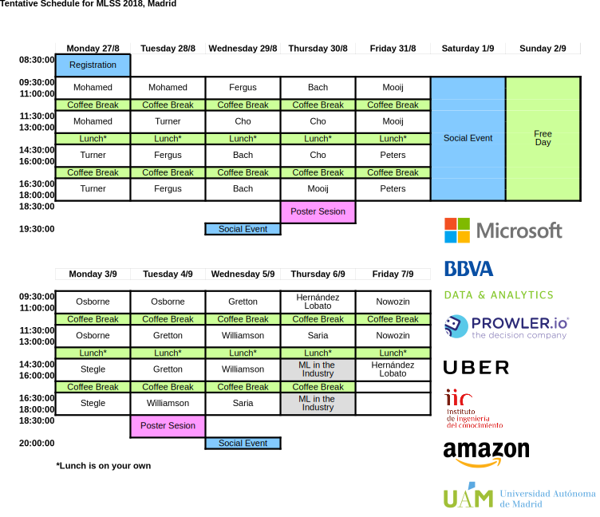

# Machine Learning Summer School 2018

## Available material

- **Optimization** by Francis Bach [slides](slides/francis_bach_optimization/bach.pdf)
- **Causal Inference** by Joris Mooij
[slides](slides/joris_mooij_causal_inference/mooij.pdf)
, [exercices](slides/joris_mooij_causal_inference/mooij_ex.pdf)
- **Gaussian Processes** by Richard Turner [slides1](slides/richard_turner_gaussian_processes/turner1.pdf)
, [slides2](slides/richard_turner_gaussian_processes/turner2.pdf)
, [slides3](slides/richard_turner_gaussian_processes/turner3.pdf)
- **Bayesian Deep Learning** by Shakir Mohamed [slides](slides/shakir_mohamed_bayesian_deep_learning/mohamed.pdf)
- **Neural Laungauge Models** by Kyunghyun Cho
 [slides1](slides/kyunghyun_cho_neural_language_models/cho1.pptx)
,[slides2](slides/kyunghyun_cho_neural_language_models/cho2.pptx)
,[slides3](slides/kyunghyun_cho_neural_language_models/cho3.pptx)
,  [case1](slides/kyunghyun_cho_neural_language_models/cho_case1.pptx)
,  [case2](slides/kyunghyun_cho_neural_language_models/cho_case2.pptx)
,  [case3](slides/kyunghyun_cho_neural_language_models/cho_case3.pptx)
- **Bayesian Optimization and Probabilistic Numerics** by Michael Osborne [slides1](slides/michael_osborne_bayesian_optimization_and_prob_numerics/osborne1.pdf)
,[slides2](slides/michael_osborne_bayesian_optimization_and_prob_numerics/osborne2.pdf)
,[slides3](slides/michael_osborne_bayesian_optimization_and_prob_numerics/osborne3.pdf)
- **Generative Adversarial Networks** by Sebastian Nowozin
  [slides1](slides/sebastian_nowozin_gans/gans.pdf)

## Schedule

  

